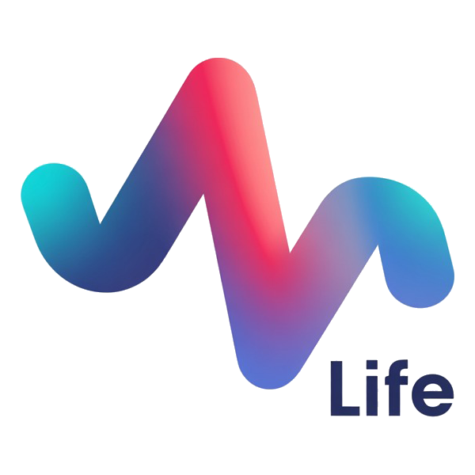

<p align="center">
  
</p>

<h1 align="center">X-Life</h1>

[](https://opensource.org/licenses/MIT)
[](https://www.python.org/)
[](https://pytorch.org/)
[](https://unity.com/)
[](placeholder)
[](#citation)

<p align="center">
  <strong>X-Life</strong> is a metabolic world-model system for adaptive lifestyle medicine that translates continuous physiological data and sensing into personalised, quantitative dietary and postprandial activity prescriptions, concurrently meeting individual lifestyle preferences, contextual settings and safety constraints.
</p>

## 📋 Table of Contents

- [📋 Table of Contents](#-table-of-contents)
- [🌟 Overview](#-overview)
- [🚀 Quick Start](#-quick-start)
  - [System Requirements](#system-requirements)
    - [Software Dependencies](#software-dependencies)
    - [Hardware Requirements](#hardware-requirements)
  - [Installation](#installation)
    - [1. Clone the Repository](#1-clone-the-repository)
    - [2. Create Python Environment](#2-create-python-environment)
    - [3. Install Python Dependencies](#3-install-python-dependencies)
    - [4. Install Neo4j Service](#4-install-neo4j-service)
- [🏗️ Core Modules](#️-core-modules)
  - [1. 🕸️ Lifestyle Prescription Generation Module](#1-️-lifestyle-prescription-generation-module)
    - [Configuration Steps](#configuration-steps)
    - [Test Pipelines](#test-pipelines)
  - [2. 🧠 Diet/Exercise Sub-world model and Ranking Module](#2--dietexercise-sub-world-model-and-ranking-module)
  - [3. 🛡️ Safety Module](#3-️-safety-module)
  - [4. 🧬 Multi-omics Model](#4--multi-omics-model)
  - [5. 🥽 AR Deployment](#5--ar-deployment)
    - [Hardware / Platform](#hardware--platform)
    - [Software Environment](#software-environment)
    - [Dependencies](#dependencies)
      - [A. Vuplex 3D WebView (Required, Not Included)](#a-vuplex-3d-webview-required-not-included)
      - [B. XREAL XR Plugin (Required, Already Configured)](#b-xreal-xr-plugin-required-already-configured)
      - [C. Unity Package Manager Dependencies (Auto-installed)](#c-unity-package-manager-dependencies-auto-installed)
    - [Project Setup](#project-setup)
      - [4.1 Configure the WebView Initial URL](#41-configure-the-webview-initial-url)
      - [4.2 (Optional) Configure iFLYTEK Speech Recognition](#42-optional-configure-iflytek-speech-recognition)
    - [Build APK](#build-apk)
      - [Pre-build Checklist](#pre-build-checklist)
      - [Build Steps in Unity (Android)](#build-steps-in-unity-android)
    - [Troubleshooting](#troubleshooting)
- [📊 Minimal Dataset](#-minimal-dataset)
- [📄 License](#-license)

## 🌟 Overview

This repository contains the code, packages, and sample dataset for the paper **"A metabolic world model system for personalised lifestyle medicine"**.


## 🚀 Quick Start

### System Requirements

#### Software Dependencies
- **Python**: 3.10+
- **PyTorch**: 2.6+
- **JDK**: 17.0.18+
- **Unity3D**: 2022.3.x
- **Neo4j**: 5.26.21+

#### Hardware Requirements
- **Training**: NVIDIA A800 or equivalent GPU
- **AR Deployment**: Android 14+ compatible device

### Installation

#### 1. Clone the Repository
```bash
git clone https://github.com/2025XLife/Project-01.git
cd Project-01
```

#### 2. Create Python Environment
```bash
# Using conda (recommended)
conda create -n xlife python=3.10 -y
conda activate xlife
```

#### 3. Install Python Dependencies
```bash
pip install -r requirements.txt
```

#### 4. Install Neo4j Service
```bash
# Install JDK
sudo apt install openjdk-11-jdk
# Verify JDK version
java -version
```

Download the latest Neo4j tarball from [Neo4j Deployment Center](https://neo4j.com/deployment-center/?gdb-selfmanaged) and start the service:
```bash
tar zxf neo4j-community-5.26.21-unix.tar.gz
cd neo4j-community-5.26.21/bin/
./neo4j start
```

## 🏗️ Core Modules


### 1. 🕸️ Lifestyle Prescription Generation Module

The knowledge-graph-guided lifestyle prescription generation module generates personalized diet and exercise prescriptions by grounding LLM outputs in a hybrid vector-graph metabolic knowledge base, safeguarded by a safety module that enforces clinical safety through semantic auditing and deterministic constraints.

#### Configuration Steps

**1. Configure Database and Models**
Configure Neo4j database, remote LLM API, and local models in `./kg_module/config.json`:

```json
{
    "neo4j": {
        "uri": "bolt://127.0.0.1:7687",
        "username": "your_username",
        "password": "your_password"
    },
    "api_model": {
        "api_key": "your_api_key",
        "base_url": "your_base_url",
        "model": "your_api_model"
    },
    "local_model_path": "your_local_LLM_path",
    "local_emb_path": "your_local_embedding_model_path"
}
```

**2. Prepare Guidelines**
Prepare guidelines following the descriptions in our paper:
```
.
├── data/
│   ├── diet/
│   │   ├── diet_guideline_1.pdf
│   │   └── ...
│   └── exercise/
│       ├── exercise_guideline_1.pdf
│       └── ...
```

**3. Extract and Embed Entities**
Make sure the Neo4j server has started:
```bash
cd kg_module
# Extract knowledge from ./data
python -m core.build_kg
# Import knowledge graph
python -m core.import_kg
# (Optional) Embedding knowledge graph
python -m core.embed_kg
```

#### Test Pipelines

**Generation and Assessment Pipelines**
```bash
# Test diet prescription pipeline
python -m pipeline.diet_pipeline --bn 1 --vn 5 --query "I want a sandwich with just veggies, no meat." --use_vector --rag_topk 5
# Test exercise prescription pipeline
python -m pipeline.exer_pipeline --bn 1 --vn 4 --query "I want to do some back exercises at the gym." --use_vector --rag_topk 5
```

**Start Flask Service**
```bash
python server.py
```

**API Interface Testing**
```bash
# Diet prescription generation
curl -X POST http://localhost:5000/api/v1/diet/generate-only \
  -H "Content-Type: application/json" \
  -d '{args}'

# Exercise prescription generation
curl -X POST http://localhost:5000/api/v1/exercise/generate-only \
  -H "Content-Type: application/json" \
  -d '{args}'

# Safety module assess prescription
curl -X POST http://localhost:5000/api/v1/safety/evaluate \
  -H "Content-Type: application/json" \
  -d '{
    "plan_type": "diet/exercise",
    "user_metadata": {detailed_metadata},
    "plan": {plan_to_assess}
  }'
```

For detailed prompt sample of prescription generation, prescription assessment and knowledge graph extraction, you can refer to [kg_agents/sample_prompts.md](./kg_agents/sample_prompts.md)

### 2. 🧠 Diet/Exercise Sub-world model and Ranking Module

Diet/Exercise sub-world models predict latent metabolic state for diet prescription candidates. The glucose predict head simulates the glycemic trajectories 

1. Data Preparation.
Prepare the user metadata and physiological trajectory in the following format:
```bash
[
    {
        "subject_id": "XXX",
        "subject_name": "XXX",
        "metadata": {
        },
        "meals": [
          {
            "food_data": {
              "food_id": "XXXX",
              "date":"XXXX" ,
              "meal_type":"XXXX" ,
              "data": {
                "time":,
                "food_items": [
                  {
                    "img_names": 
                  }
                ]
              }
            },
            "exercise_data_after_meal": {},
            "cgm_preprandial": [],
            "cgm_postprandial": [],
            "sleep_data": {}
          }
        ],
        "nocturnal_hypoglycemia": [
          {
            "date": "XXXX",
            "cgm_pre_sleep": [],
            "cgm_sleep": []
          }
        ]
      }
]
```
We also prepare the minimal dataset in `./world_model+ranking_module/data`. `sample_data.json` includes the metadata, diet information, exercise information, sleep information. `sample_meal_01.jpg` is the diet image.

2.Model config. In `model_config.py`, the `default` settings can be used directly, which are consistent with the experimental configuration reported in our paper.  Notably, X-Life supports all open-source LLMs and VLMs.
```bash
vim world_model/model_config.py
```
3.Training. The `train()` in `main.py` handles the model training process. During training, it reports the loss and Pearson correlation coefficient (Pearson's r) at each epoch. When saving checkpoints, the model with the best Pearson's r on the validation set is selected and stored as the optimal model. Users are required to modify `image_dir`, `data_path`, `save_dir` and `get_training_config() `. After configuring the parameters, run the following command to train the model：
```bash
python main.py
```

4.Evaluation. After training is completed, the model can be evaluated by switching it to `trainer.evaluate()`. The model will output the predicted CGM values along with the corresponding evaluation metrics. The code is shown below: 
```bash
python main.py
```

5.Multi-stage alignment. We follow the official [repo](https://github.com/eric-mitchell/direct-preference-optimization) to complete multi-stage alignment, enabling the model to output personalized lifestyle prescriptions.


### 3. 🛡️ Safety Module

A safety module based on retrieval-augmented generation is designed to enforce safety constraints and reduce hallucination risk of lifestyle prescriptions. We use [DeepSeek-R1]([https://huggingface.co/deepseek-ai/DeepSeek-R1]) as the backbone. The designed system prompt is in  [kg_agents/sample_prompts.md](./kg_agents/sample_prompts.md).

### 4. 🧬 Multi-omics Model

The model supports multi-omics-based glucose prediction. The command to run it is as follows:
```bash
python train_omics_modality_models.py \
  --labels labels.csv \
  --covariates covariates.csv \
  --metagenome metagenome.csv \
  --lipid_metabolome lipid_metabolome.csv \
  --proteome proteome.csv \
  --outdir results_omics_models \
  --key_col case_id \
  --group_col subject_id \
  --day_col day_index \
  --target_col iAUC_2h_true_baseline_sub_pos_dx5 \
  --test_size 0.2 \
  --seed 42 \
  --lgb_n_splits 5 \
  --lgb_n_estimators 2000 \
  --lgb_top_k 300 \
  --optuna_trials 200 \
  --calib_bins 10 \
  --calib_strategy quantile
```

### 5. 🥽 AR Deployment

This Unity project targets **XREAL AR** devices to:
- Embed a web page as the main UI via **Vuplex 3D WebView** (WebView scene)
- Trigger **XREAL RGB Camera** capture / screen recording from the web page (camera capture scene)
- Send capture results (photos/videos, local file paths / local HTTP URLs, etc.) back to the web page via `postMessage`

#### Hardware / Platform

- Target platform: Android
- Device: XREAL devices / runtimes that support XREAL XR Plugin (and any Android device that can install an APK)
- Debugging: USB cable + USB debugging enabled (required for Build & Run)


#### Software Environment

- **Unity**: `2022.3.x` (this project uses `2022.3.61t8` in `ProjectSettings/ProjectVersion.txt`)
- **Unity Hub modules**: Android Build Support (SDK / NDK / OpenJDK)
- **Optional**: `adb` (usually not needed if you use Unity's Build & Run; needed for CLI install/debugging)
- **Download**: Please download the complete Unity project [XLIFE-AR.zip](https://drive.google.com/file/d/1Ul-z-lDQSRvFw9aqk6uxIVhMamKpvAJM/view?usp=sharing)

#### Dependencies

> The two most common blockers are: **Vuplex (commercial, not included in the repo)** + **XREAL XR Plugin (provided as a local tar package)**.

##### A. Vuplex 3D WebView (Required, Not Included)

- Purchase and import (Unity Asset Store): [Vuplex 3D WebView for Android (with Gecko Engine)](https://assetstore.unity.com/packages/tools/network/vuplex-3d-webview-for-android-with-gecko-engine-245867)
- After importing, you should see: `Assets/Vuplex/WebView/...`, and be able to use `CanvasWebViewPrefab` in scenes
- Note: if you want to run WebView directly in the macOS/Windows Editor, you may need to install the native plugins for those platforms per Vuplex docs; building for Android only is fine

##### B. XREAL XR Plugin (Required, Already Configured)

- Included in this project: `Packages/com.xreal.xr.tar.gz`
- `Packages/manifest.json` references the local package: `"com.xreal.xr": "@com.xreal.xr.tar.gz"`
- To upgrade the plugin: replace `Packages/com.xreal.xr.tar.gz` and keep the `manifest.json` reference consistent

##### C. Unity Package Manager Dependencies (Auto-installed)

After opening the project, Unity resolves dependencies from `Packages/manifest.json` automatically (e.g., Input System / AR Foundation / XR Interaction Toolkit). In most cases you do not need to install anything manually in Package Manager.

#### Project Setup

##### 4.1 Configure the WebView Initial URL

1. Open the scene: `Assets/Scenes/WebView.unity`
2. Select `CanvasWebViewPrefab` in the scene hierarchy
3. Set `InitialUrl` to your web URL
   - Current example value: `https://xlife.chat/MainPage/AR`

##### 4.2 (Optional) Configure iFLYTEK Speech Recognition

**REQUIRED if you want to use speech recognition features.**

The speech recognition config file is: `Assets/Resources/XunfeiConfig.json`

1. Register at [iFLYTEK Open Platform](https://www.xfyun.cn/) and create an application
2. Obtain your API credentials (appId, apiKey, apiSecret)
3. Edit `Assets/Resources/XunfeiConfig.json` and fill in:
   - `appId`: Your application ID
   - `apiKey`: Your API Key
   - `apiSecret`: Your API Secret

Alternatively, you can create a ScriptableObject config in Unity Editor:

- Right-click in Project window → Create → XLIFE AR → Xunfei Speech Recognition Config
- Set the credentials in the Inspector
- Place the config asset in `Assets/Resources/` folder

#### Build APK

##### Pre-build Checklist

- Vuplex is imported correctly (otherwise you will see compilation errors like missing `Vuplex.WebView` namespace)
- `Packages/com.xreal.xr.tar.gz` exists and Unity Package Manager shows no errors
- Scenes are included in Build Settings (this project should already be configured, but double-check):
  - `Assets/Scenes/WebView.unity`
  - `Assets/Scenes/RGBCameraAndCapture.unity`

##### Build Steps in Unity (Android)

1. `File -> Build Settings...`
2. Select `Android`, then click `Switch Platform`
3. In `Scenes In Build`, make sure `WebView` and `RGBCameraAndCapture` are enabled (recommended: put `WebView` first)
4. `Edit -> Project Settings -> XR Plug-in Management`
   - In the `Android` tab, enable **XREAL** (XREAL XR Loader)
5. `Player Settings -> Other Settings` (recommended values; adjust as needed)
   - `Scripting Backend`: IL2CPP
   - `Target Architectures`: ARM64
6. Connect an Android device (Developer Mode + USB debugging enabled), then click `Build And Run`
   - Or click `Build` to export an `.apk` and install it manually

> Note: this project includes a custom manifest at `Assets/Plugins/Android/AndroidManifest.xml`, which declares network/microphone/screen-capture related permissions, including the Android 14+ foreground service permission `FOREGROUND_SERVICE_MEDIA_PROJECTION`.

#### Troubleshooting

- `The type or namespace name 'Vuplex' could not be found`: Vuplex 3D WebView is not imported
- WebView is blank / cannot load: check `InitialUrl`, device network, and whether cleartext HTTP is allowed (if using `http`)
- Camera / screen recording does not work in Editor: XREAL capture APIs typically only work on real Android devices (there is also a mock branch in scripts)
- Screen recording issues on Android 14+: make sure you did not overwrite/remove the foreground service permission declarations in `Assets/Plugins/Android/AndroidManifest.xml`


## 📊 Minimal Dataset

A minimal, de-identified sample dataset containing representative CGM traces and structured lifestyle logs is available at `./world_model+ranking_module/data`. The sample is specifically formatted for computational compatibility with the X-Life preprocessing and modeling pipelines, enabling code verification and functional demonstration. It is intended exclusively for testing and development purposes. 

## 📄 License

This project is licensed under the MIT License - see the [LICENSE](LICENSE) file for details.
$$
